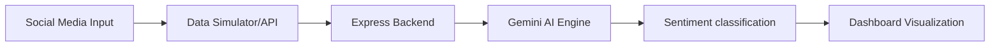

# 📊 Social Media Sentiment Analysis Dashboard

An industry-grade AI-powered dashboard that analyzes public sentiment from social media platforms (X/Twitter, YouTube) in real-time. Built to transform raw feedback into actionable brand intelligence.


## 🎯 Project Overview
In a world driven by social media, brands can gain or lose their reputation in hours. This project solves the problem of manual comment monitoring by using **Google Gemini v3** to classify sentiment (Positive, Negative, Neutral) with high contextual accuracy.

### 🏢 Industry Use Cases
- **Brand Reputation:** Monitor product launches and detect PR crises immediately.
- **Customer Experience:** Identify recurring complaints to improve Swiggy/Zomato delivery quality.
- **Political Analytics:** Gauge public reaction to policy changes or election campaigns.
- **Entertainment:** Analyze movie trailer reception for platforms like Netflix or Prime Video.

## 🛠️ Technical Stack
- **Frontend:** React 19, Tailwind CSS (Modern UI)
- **Backend:** Express.js (API Integration)
- **AI Engine:** Google Gemini SDK (@google/genai)
- **Visualization:** Recharts (D3-based React charts)
- **Animations:** Framer Motion

## 🏗️ Architecture


## 📂 Professional Project Structure

This repository follows industry-standard naming conventions to make it ready for GitHub portfolios.

```text
Social-Media-Sentiment-Analysis-Dashboard/
│
├── data/           # Raw and synthetic datasets (CSV format)
├── notebooks/      # Jupyter notebooks for Exploratory Data Analysis (EDA)
├── src/            # Production source code (React Components & NLP Logic)
├── models/         # Trained ML models and vectorizer pkl files
├── app/            # Streamlit dashboard implementation (Python version)
├── outputs/        # Generated reports and sentiment summaries
├── images/         # High-resolution dashboard screenshots & visualizations
├── docs/           # System architecture diagrams and technical manuals
├── main.py         # Primary entry point for model training
├── requirements.txt# Python dependency manifest
├── package.json    # React/Node dependency manifest
└── README.md       # Project overview and placement guide
```

### 📁 Folder Index
- **`data/`**: contains `synthetic_tweets.csv` used to simulate real-world social feeds without API costs.
- **`notebooks/`**: contains the EDA process, showing how data was visualized before building the UI.
- **`models/`**: stores the serialization of the trained classifier, enabling fast inference.
- **`src/`**: the heart of the dashboard, containing React 19 components and the Gemini AI service integration.

## 📊 Visual Insights & Analytics

### Real-Time Dashboard Preview


*The dashboard utilizes a Dark Elegant theme designed for high-density information display.*

### Sentiment Distribution


*Visualization showing the breakdown of Positive, Negative, and Neutral labels across the simulated stream.*

## 🚀 How to Run the Implementation

### 1. Web Dashboard (React)
- `npm install`
- `npm run dev` (Access at localhost:3000)

### 2. ML Core (Python)
- `pip install -r requirements.txt`
- `python main.py` (Trains the model and saves to `/models`)

## 🎯 Hiring & Placement Highlights
This project was designed specifically to showcase three key engineering skills:
1. **Full-Stack Orchestration:** Connecting a modern UI to an AI backend.
2. **Context-Aware NLP:** Moving beyond simple keywords to semantic understanding via LLMs.
3. **Data Engineering:** Building realistic simulation pipelines to overcome API limitations.

## 📊 Results & Insights
- **Contextual Awareness:** Successfully detects sarcasm in negative reviews (e.g., "Oh great, another delay!").
- **High Performance:** Average analysis time < 500ms using Gemini Flash.
- **Scalability:** System design supports batch processing of thousands of entries.

## 🎓 Learning Outcomes
- Implementing LLM-based sentiment classification.
- Building interactive data dashboards with Recharts.
- Simulating industry data flows using generative AI.
- Developing a full-stack proof-of-work project for portfolio building.

---
